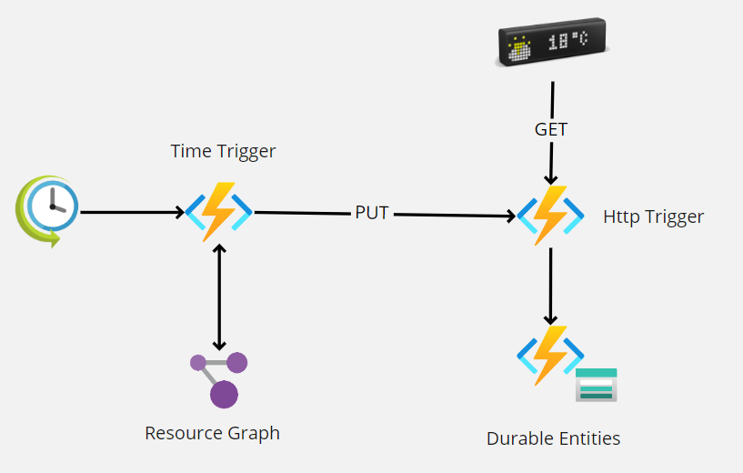
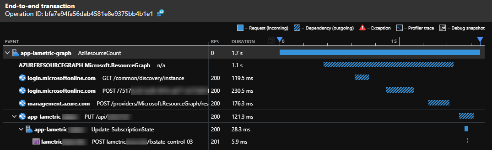
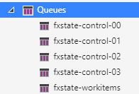
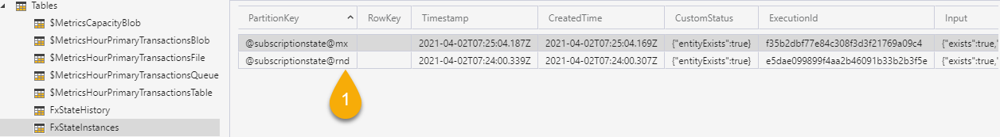
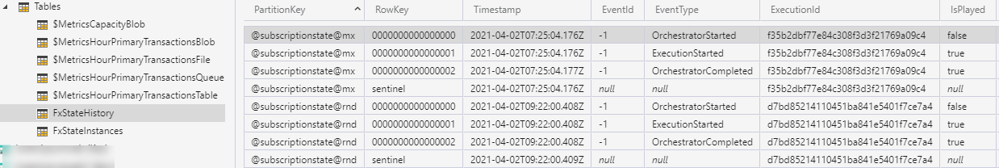

# lametric-azure
**Context** : I want to keep an eye on how many resources are currently provisioned on a specific Azure subscription and understand when we are adding or removing resources.

The architecture is pretty straightforward:



In this example I am using  Azure functions to query the Azure Resource Graph to count the resources using a simple query like the following: 
```
Resources | summarize count()
```
The result of the query is persisted using an Azure Durable Entity function activated via an HTTP.

The entity state looks as the following:
```
{
    "entityExists": true,
    "entityState": {
        "Name": null,
        "PreviousRead": 575,
        "LastRead": 571,
        "UpdatedOn": "2021-04-01T19:44:04.5683114Z"
    }
}
```

The result returned to the LaMetric device is formatted this way:

```
{
    "frames": [
        {
            "text": "-4", // increment
            "icon": 124 // up or down icon
        },
        {
            "text": "571", // last read
            "icon": 37287 // azure icon
        }
    ]
}
```


## e2e visibility with Application Insights
Arcus.Observability is used to simplify the integration with Application Insights.



## notes about durable entities

- Entities stateful addressable singletons.
- Entities can be called either from durable clients (IDurableEntityClient) or from durable orchestrations (IDurableOrchestrationClient).
- Entities guarantee that requests are processed in series.
- Entities are triggered via 'control' queues (default 4) prefixed with the {[task-hub-name](https://docs.microsoft.com/en-us/azure/azure-functions/durable/durable-functions-task-hubs?tabs=csharp)}. 
    -  Only a single Azure Function instance can read from a single queue at a certain time. This is guarantee by the blob leases approach of the durable framework.
    - from a scale prospective, 4 queues means maximum 4 azure function instances.
    - the Functions scale controller add/remove instances according to the queue latency for peeking messages.
    
    
    
- [Data persistence](https://docs.microsoft.com/en-us/azure/azure-functions/durable/durable-functions-serialization-and-persistence?tabs=csharp) for Durable Functions.
- [Performance and scale](https://docs.microsoft.com/en-us/azure/azure-functions/durable/durable-functions-perf-and-scale) of durable functions.

The Entity instances are persisted in the 'Instances' table with the key @{entityname}@{entityid}



History table contains the events occurred for every instance. There is one table per "hubname".

